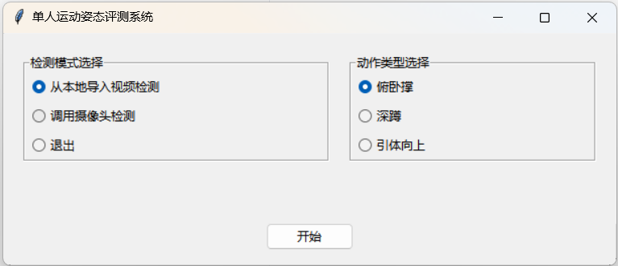
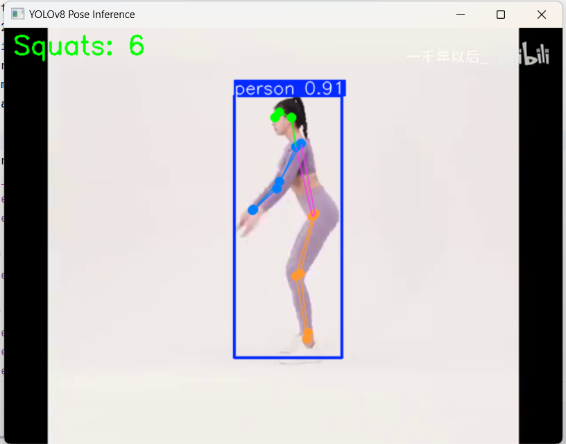
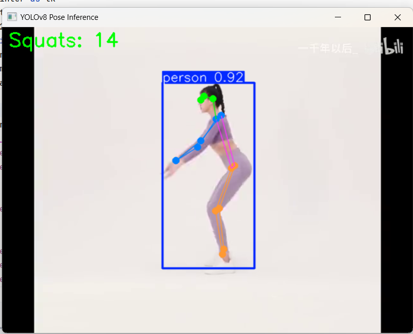
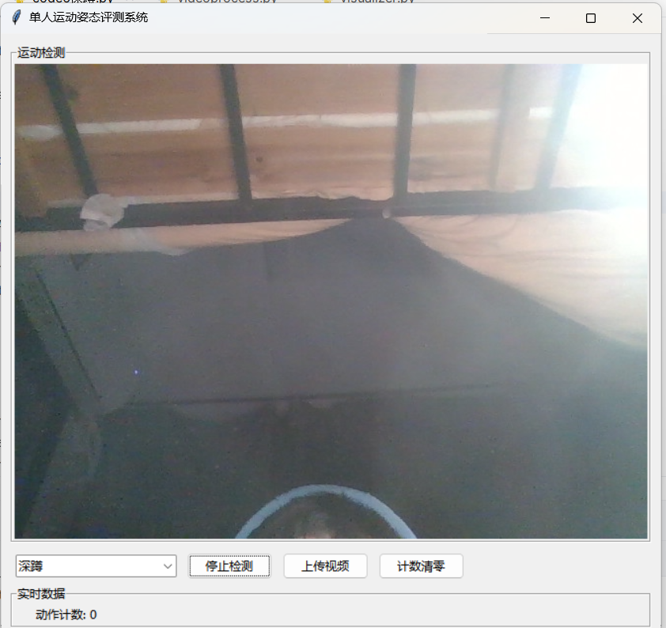
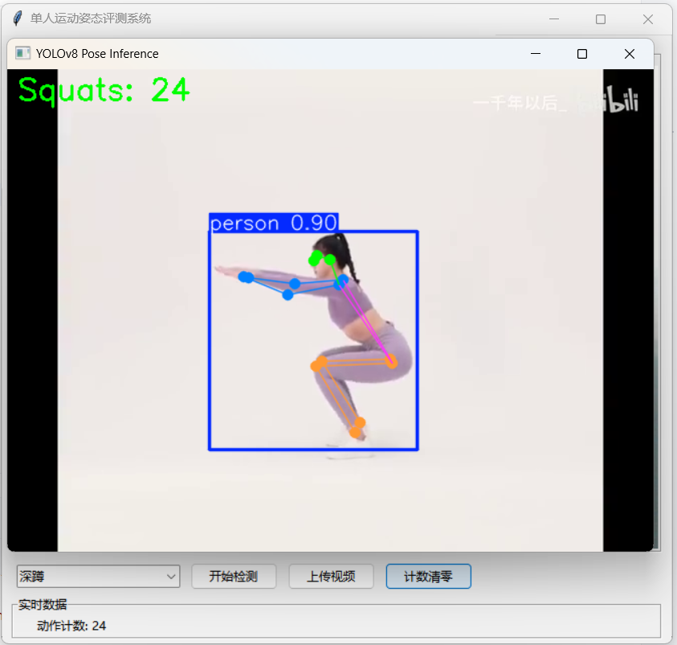

# 基于视觉的运动动作识别与评估算法研究  

**时间**：2024.09 – 2025.03  
**性质**：课程大作业  
**更新**：2026.01 | 重新整理至 GitHub  

## 项目背景

本项目旨在通过计算机视觉技术实现非接触式健身动作识别，自动判断用户是否完成标准深蹲或引体向上动作，并进行计数。核心挑战在于如何在不同体型、视角和光照条件下稳定识别动作状态。

为此，我们实现了两种互补的技术路线：
1. **基于人体骨骼图结构的几何规则方法**（Code4–6）：利用 MediaPipe 提取的 33 个关键点构建人体图，通过关节角度或相对位置设定阈值进行判定；
2. **基于 KNN 的机器学习方法**（Code7）：从关键点中提取归一化特征向量，使用 K 近邻算法分类，并结合 EMA 平滑与双阈值机制实现稳定计数。

两种方法均集成于统一的 Tkinter GUI 界面，支持摄像头实时检测与视频文件离线分析.

## 图结构与几何规则（Code4–6）

该方法将人体建模为由 MediaPipe 定义的 33 个关键点构成的图结构，通过计算特定关节间的几何关系实现动作判别。

对于**引体向上**（Code4–5），系统比较手腕与头部/肩部的垂直位置：手腕高于下巴视为“上”，低于腰部视为“下”。  
对于**深蹲**（Code6），系统计算左右腿的髋–膝–踝夹角。当双膝角度小于 90° 时判定为“下蹲到位”，大于 160° 时判定为“站起完成”，并通过状态机检测“下→上”的完整周期以实现计数。

该方法无需训练数据，逻辑透明且实时性强，但对姿势变形或遮挡较为敏感，且阈值需人工调优，泛化能力有限。

## KNN 与特征学习（Code7）

该方法将姿态识别建模为监督分类任务。系统在运行时对输入视频或摄像头流逐帧处理：首先调用 MediaPipe Pose 模型检测当前帧中的人体关键点。若未检测到有效姿态（如关键点置信度过低或躯干关键点缺失），则跳过该帧，维持当前状态；否则，进入后续分析流程。

在特征工程阶段，系统以躯干（肩–髋）为基准对姿态进行归一化，消除尺度与朝向差异，并构造 9 维特征向量，包括：
- 左右肩–腕距离、髋–踝距离；
- 腕间距、踝间距；
- 肩宽与髋宽之比；
- 左右膝关节角度。

使用 K=5 的 K 近邻分类器（欧氏距离）对特征向量进行预测。为抑制帧间抖动，对分类概率输出应用指数移动平均（EMA）：
$$
V_t = \alpha \cdot p_t + (1 - \alpha) \cdot V_{t-1}, \quad \alpha = 0.3
$$

动作计数采用双阈值状态机机制：当目标类别（如深蹲“下”）的 EMA 概率超过 0.7 时，标记为“进入该姿态”；当概率回落至 0.3 以下时，视为完成一次有效动作，计数加一。该设计有效避免了在决策边界附近因噪声导致的反复触发。

该方法依赖于离线训练的模型和标注数据，推理延迟高于纯几何规则方法，但对不同用户体型和动作风格具有更强的适应性，更适合需要高精度识别的场景。

## GUI 系统设计

系统采用统一的 Tkinter 界面，支持以下功能：
- 选择动作类型（深蹲 / 引体向上）；
- 切换输入源（摄像头实时流 或 本地视频文件）；
- 实时显示带骨骼关键点的画面；
- 展示当前识别姿态与完成次数；
- 提供“开始/停止”和“退出”控制按钮。

KNN 方法因涉及模型加载与逐帧推理，视频处理模式为**离线批处理**，处理完成后将结果视频保存至同目录。

图结构对应GUI：

<table>
  <tr>
    <td align="center"></td>
    <td align="center"></td>
    <td align="center"></td>
  </tr>
</table>

KNN对应GUI：
  

## 功能演示

以下是系统运行过程中的典型画面：

<table>
  <tr>
    <td align="center">
      
    </td>
    <td align="center">
      
    </td>
  </tr>
</table>
*上传视频后，系统自动解析人体姿态。*

  
*摄像头实时捕捉人体姿态。*

  
*手动重置计数，便于多次测试。*

  
*页面显示运动数量。*

## 总结

本项目对比了基于规则与基于学习的两种姿态识别范式。图结构方法凭借其确定性和低开销，适用于标准化、高实时性场景；KNN 方法则通过数据驱动提升了对个体差异的适应能力，更适合精度优先的应用。

通过本项目，我们完整实践了从关键点提取、特征工程、模型训练、状态机设计到 GUI 集成的全流程。未来可进一步探索图神经网络（GNN），将人体图结构的先验知识与端到端学习能力相结合，兼顾可解释性与泛化性能。

## 后记

时隔几个月（2026.01），为了找实习，我重新整理了项目并建立github仓库。会看代码和报告，我深感当时第一次接触研究项目时（大二）所做深度有限，代码和报告都显得颇为幼稚/青涩，逻辑也存在冗余。愿无限进步。

> “所有伟大的成就，都始于一个不完美的开始。”